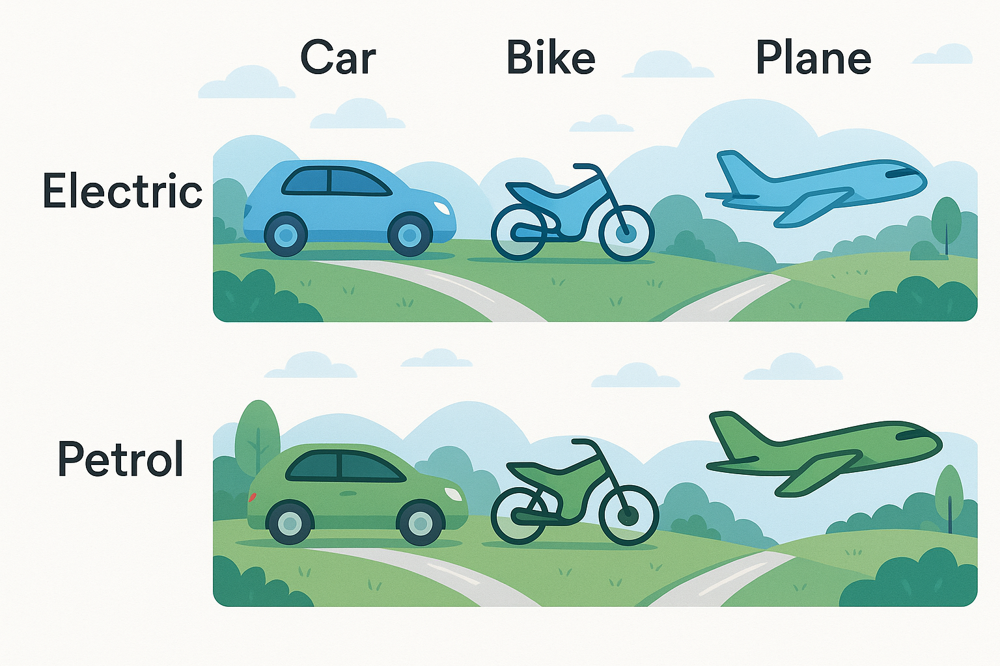

# Factory Design Patterns in Java

## Overview
Factory patterns are creational design patterns that provide an interface for creating objects without exposing the instantiation logic. These patterns help improve maintainability, flexibility, and scalability in software design.

---
## 1. Simple Factory Pattern
### Definition
A **Simple Factory** is a class that provides a method to create objects of different types based on input parameters. It centralizes object creation but does not strictly adhere to design pattern principles.

### Structure
- **Factory Class:** Contains a method to create objects.
- **Product Interface:** Defines a common contract for products.
- **Concrete Products:** Implement the product interface.

### Use Case
- When object creation logic needs to be centralized.
- Suitable for applications where types are known in advance.

### Advantages
✔ Centralized object creation simplifies maintenance.  
✔ Reduces code duplication across the application.

### Disadvantages
✘ Violates the Open-Closed Principle (OCP) since modifying the factory requires changing existing code.  
✘ Becomes cumbersome as the number of product types grows.

---
## 2. Factory Method Pattern
### Definition
A **Factory Method** defines an interface for creating objects but allows subclasses to alter the type of objects that will be created.

### Structure
- **Factory Interface (Abstract Creator):** Declares a method for object creation.
- **Concrete Factories:** Implement the factory method to create specific products.
- **Product Interface:** Defines a common contract for all product variants.
- **Concrete Products:** Implement the product interface.

### Use Case
- When the exact type of object to be created is determined by subclasses.
- When a superclass delegates the responsibility of instantiation to derived classes.

### Advantages
✔ Follows OCP (Open-Closed Principle) as new products can be added without modifying existing code.  
✔ Promotes loose coupling by relying on interfaces instead of concrete classes.

### Disadvantages
✘ Introduces additional complexity by requiring multiple factory classes.  
✘ Can lead to code bloat if too many factories are created.

---
## 3. Abstract Factory Pattern
### Definition
An **Abstract Factory** provides an interface for creating families of related objects without specifying their concrete classes.

### Structure
- **Abstract Factory Interface:** Defines methods for creating related products.
- **Concrete Factories:** Implement the abstract factory to produce specific product types.
- **Product Interfaces:** Define contracts for all product categories.
- **Concrete Products:** Implement product interfaces for each category.

### Use Case
- When multiple families of related objects need to be created together.
- When a system needs to be independent of how its objects are created, composed, and represented.

### Advantages
✔ Ensures consistency among objects created within the same family.  
✔ Helps in managing complex object hierarchies.  
✔ Encourages code modularity and separation of concerns.

### Disadvantages
✘ Complex to implement compared to other factory patterns.  
✘ Harder to maintain if there are frequent changes in product families.

---
## Comparison of Factory Patterns

| Feature               | Simple Factory | Factory Method | Abstract Factory |
|----------------------|---------------|---------------|----------------|
| **Object Creation** | Centralized in one factory class | Decentralized via factory subclasses | Multiple related objects created by one factory |
| **Flexibility** | Low (modifications require changes in factory class) | Medium (new factories can be added easily) | High (supports product families) |
| **Complexity** | Simple | Moderate | High |
| **Use Case** | When object creation logic needs to be centralized | When object creation should be delegated to subclasses | When multiple related objects need to be created together |
| **Example Scenario** | A factory that creates vehicles based on input | Different factories for each vehicle type | A factory that creates electric or Petrol vehicles |

---
## Conclusion
Each factory pattern serves a specific purpose. Use **Simple Factory** for straightforward cases, **Factory Method** for scenarios requiring flexibility, and **Abstract Factory** when multiple families of objects need to be managed efficiently.

---
### Author
This document was prepared to explain the differences and use cases of Factory Design Patterns in Java.

